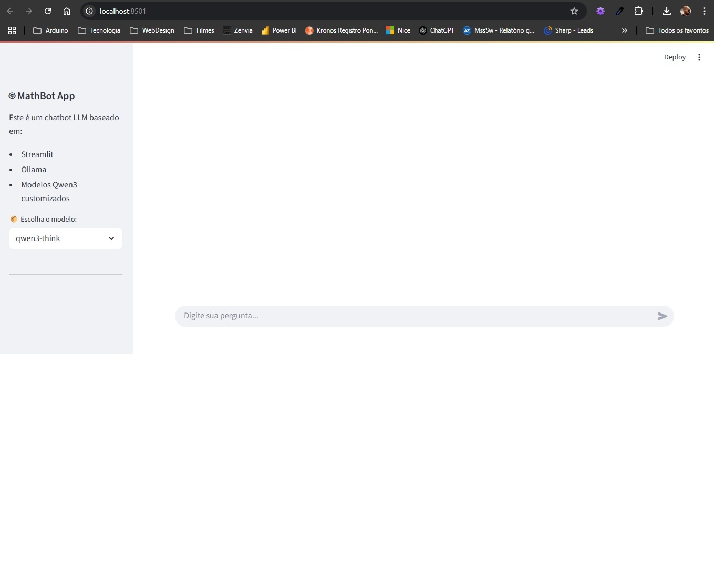
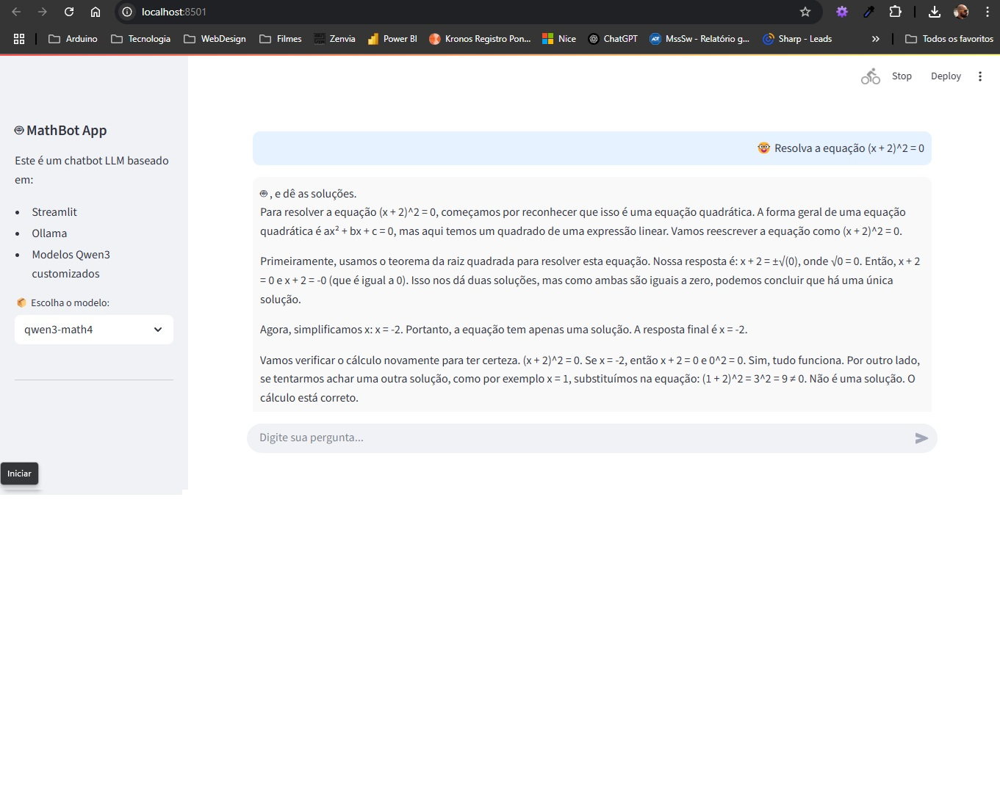

# Fine-Tuning e Criação de Bot com LLMs Locais

Este projeto tem como objetivo realizar fine-tuning em modelos LLM pequenos (como LLaMA3.2 1B e Phi-3-mini).

---

## ⚠️ Dificuldades Enfrentadas

###  1. Limitações de Hardware Local

- GPU **NVIDIA MX110** - A placa instalada em um notebook não é compatível com Unsloth para treinamento e não é suficiente para outras formas de fine tuning.
- Memória VRAM insuficiente para modelos quantizados, causando `ValueError` ao carregar com `transformers`.

###  2. Problemas com Instalação de Modelos

- Bloqueio de acesso via **Zscaler** impediu o download de modelos via `ollama`.

###  3. Tempo de Execução no Colab

- Ambientes gratuitos como **Google Colab** desconectam por inatividade ou limite de tempo, interrompendo o treinamento.
- Uso de modelos como `LLaMA3.2-1B`, `Mistral` e outros testados, mostrou-se inviável devido ao tempo de carregamento e treinamento, mesmo usando a plataforma Google Colab.

---

## ✅ Soluções Aplicadas

###  Uso do modelo `Gwen-3-1B`

- **Mais leve**, rodou razoavelmente bem no Colab T4 (free tier).
- Permitiu fine-tuning com batches pequenos (~500 exemplos) sem erros.

###  Ajustes no Código

- **Redução do tamanho do dataset** para 500 linhas.
- **Divisão por batches** e redução no número de `steps` e `epochs`.

###  Streamlit + Qwen3

- Após o treinamento, o modelo pode ser carregado localmente via **Qwen3** com `ollama`.
- Interface amigável com **Streamlit** para testar perguntas/respostas usando documentos vetorizados (RAG).

---

##  Instruções de Uso

###  Requisitos

- Python 3.10+
- CUDA (caso vá usar GPU no Colab Pro+)
- Pacotes:
  - `transformers`
  - `unsloth`
  - `trl`
  - `torch`
  - `streamlit`
  - `langchain`
  - `sentence-transformers`
  - `faiss-cpu` ou `chromadb`

```bash
pip install torch transformers trl unsloth streamlit langchain sentence-transformers faiss-cpu
```

###  Execução Local (com modelo treinado)

```bash
streamlit run app.py
```

---

## 📦 Resultado

O modelo não performa bem, ele responde algumas perguntas corretamente, mas outras ele alucina ou responde errado. O prazo curto para desenvolvimento foi um agravante mas o resultado ruim deve-se principalmente à restrição de hardware.

O Notebook utilizado não possuia memória RAM ou GPU compatível para fine tuning local. Usando o Google Colab foi possível fazer o fine tuning mas a versão free tem uma restrição de 24 horas para uso de GPU, além do que o Colab desconecta do ambiente se não houver atividade na página, o que força a ficar interagindo com a página atá a finalização do processo.

---

## 🖼️ Exemplos e Prints

> Coloque aqui prints do terminal, do Colab e da interface do Streamlit.






---